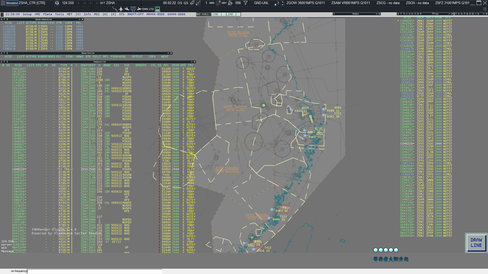

# SimpleFSD-Lite

一个用于模拟飞行联飞的FSD, 使用Go语言编写
FSD支持计划同步, 计划锁定  
本分支为主分支的Lite版本, 仅保留FSD的核心功能  
如果你想对本分支进行二次开发, 请查看[二次开发指引](./docs/development.md)  
全功能版本请移步[主分支][Full-Branch]  
[Docker Hub 仓库](https://hub.docker.com/r/halfnothing/simple-fsd-lite)  
关于docker部署请看[使用docker部署](#使用docker部署)

---
[![ReleaseCard]][Release]![ReleaseDataCard]![LastCommitCard]  
![BuildStateCard-Full]![BuildStateCard-Lite]  
![ProjectLanguageCard]![ProjectLicense]
---



## 如何使用

### 使用方法

#### 使用docker部署

##### 部署前操作

由于docker的挂载逻辑, 我们需要预先获取需要的文件  
我们通过创建一个临时的容器获取所需文件

```shell
# 运行一个临时容器
docker run -d --name temp halfnothing/simple-fsd-lite:0.6.0
# 分别复制需要的文件
docker cp temp:/fsd/config.json ./config.json
docker cp temp:/fsd/cert.txt ./cert.txt
docker cp temp:/fsd/whazzup.json ./whazzup.json
# 停止并删除临时容器
docker stop temp
docker rm temp
```

##### 如何部署

1. ***(推荐)*** 使用docker-compose文件  
   i. 复制[docker-compose文件](docker/docker-compose.yml)到任意目录  
   ii. 在docker-compose文件同目录运行命令
   ```shell
   docker compose up -d  
   ```
   iii. 如果需要添加命令行参数
   ```yml
   services:
     fsd:
       image: halfnothing/simple-fsd-lite:0.6.0
       # 省略部分字段
       command:
         - "-debug"
   ```
   iiii. docker-compose文件介绍  
   ```yml
   services:
     # 服务名
     fsd:
       # 使用的镜像
       image: halfnothing/simple-fsd-lite:0.6.0
       # 容器名称
       container_name: simple-fsd-lite
       # 容器网络模式, 当模式为host的时候ports设置无效
       # 仅当程序需要获取到客户端真实IP的时候需要开启
       # network_mode: host
       # 端口映射
       # 宿主机端口:容器端口
       ports:
         - "6809:6809"
       # 挂载卷列表
       volumes:
         - type: bind
           source: ./config.json
           target: /fsd/config.json
         - type: bind
           source: ./cert.txt
           target: /fsd/cert.txt
         - type: bind
           source: ./whazzup.json
           target: /fsd/whazzup.json
         - ./logs:/fsd/logs
       # 重启模式
       restart: always
   ```
2. 使用docker命令  
   i. 使用桥接模式, FSD无法获取到客户端真实IP  
   ```shell
   docker run -d --name simple-fsd-lite -p 6809:6809 -v ./config.json:/fsd/config.json -v ./logs:/fsd/logs -v ./cert.txt:/fsd/cert.txt -v ./whazzup.json:/fsd/whazzup.json halfnothing/simple-fsd-lite:0.6.0  
   ```
   ii. 使用host模式, FSD可以获取到客户端真实IP  
   ```shell
   docker run -d --name simple-fsd-lite --network=host -v ./config.json:/fsd/config.json -v ./logs:/fsd/logs -v ./cert.txt:/fsd/cert.txt -v ./whazzup.json:/fsd/whazzup.json halfnothing/simple-fsd-lite:0.6.0  
   ```
   iii. 如果需要添加命令行参数, 则在命令的最后添加  
   ```shell
   docker run -d ... halfnothing/simple-fsd-lite:0.6.0 -debug
   ```
3. 通过Dockerfile构建  
   i. 手动构建  
   ```shell
   # 克隆本仓库
   git clone https://github.com/Flyleague-Collection/SimpleFSD.git
   # 进入项目目录
   cd SimpleFSD
   # 迁出到本分支
   git checkout lite
   # 运行docker构建
   docker build -t simple-fsd-lite:latest .
   # 运行docker容器
   docker run -d --name simple-fsd-lite -p 6809:6809 -v ./config.json:/fsd/config.json -v ./logs:/fsd/logs -v ./cert.txt:/fsd/cert.txt -v ./whazzup.json:/fsd/whazzup.json simple-fsd-lite:latest
   # 或者以host模式运行
   docker run -d --name simple-fsd-lite --network=host -v ./config.json:/fsd/config.json -v ./logs:/fsd/logs -v ./cert.txt:/fsd/cert.txt -v ./whazzup.json:/fsd/whazzup.json simple-fsd-lite:latest
   ```
   ii. 自动构建  
   ```shell
   # 克隆本仓库
   git clone https://github.com/Flyleague-Collection/SimpleFSD.git
   # 进入项目目录
   cd SimpleFSD
   # 迁出到本分支
   git checkout lite
   # 进入docker目录并且修改docker-compose.yml文件
   cd docker
   vi docker-compose.yml
   ```
   将`image: halfnothing/simple-fsd-lite:0.6.0`这一行替换为`build: ".."`    
   然后在同目录运行  
   ```shell
   docker compose up -d
   ```

#### 普通部署

1. 获取服务器可执行文件  
   i. 在[Release]里面下载对应版本的构建  
   ii. 克隆整个存储库自己[构建](#构建方法)  
   iii. 也可以前往[Action]页面获取最新开发版(开发版本可能不稳定且会产生Bug, 请谨慎使用)
2. 执行可执行文件
3. 此时您可以  
   i. 按照[配置文件说明](#配置文件简介)编辑配置文件, 然后重启服务器以应用变更  
   ii. 不对配置文件进行修改, 让服务器以默认配置运行

### 构建方法

1. 克隆本仓库
2. 确保安装了go编译器并且版本>=1.23.4
3. 在项目根目录运行如下命令`go build -x .\cmd\fsd\`
4. \[可选\]使用upx压缩可执行文件  
   i.  (windows)`upx.exe -9 .\fsd.exe`  
   ii. (linux)`upx -9 .\fsd`
5. 等待编译完成后  
   i. 对于Windows用户, 可执行文件为fsd.exe   
   ii. 对于linux用户, 可执行文件为fsd

### 配置文件简介

```json5
{
  // 配置文件版本, 通常情况下与软件版本一致
  "config_version": "0.6.0",
  // FSD名称, 会被发送到连接到服务器的客户端作为motd消息
  "fsd_name": "Simple-Fsd",
  // FSD服务器监听地址
  "host": "0.0.0.0",
  // FSD服务器监听端口
  "port": 6809,
  // FSD服务器心跳间隔
  "heartbeat_interval": "60s",
  // FSD服务器会话过期时间
  // 在过期时间内重连, 服务器会自动匹配断开时的session
  // 反之则会创建新session
  "session_clean_time": "40s",
  // 最大工作线程数, 也可以理解为最大同时连接的sockets数目
  "max_workers": 128,
  // 最大广播线程数, 用于广播消息的最大线程数
  "max_broadcast_workers": 128,
  // 验证文件路径
  "cert_file": "cert.txt",
  // 用户密码加密类型
  // 0: 无加密
  // 1: MD5加密
  // 2: SHA256加密
  // 3: bcrypt加密
  "encryption_type": 3,
  // whazzup文件路径
  "whazzup_file": "whazzup.json",
  // whazzup文件生成间隔
  "whazzup_interval": "15s",
  // 首行发送到客户端的motd格式, 第一个参数为fsd_name, 第二个为版本号
  "first_motd_line": "Welcome to use %[1]s v%[2]s",
  // 要发送到客户端的motd消息
  "motd": [],
  // 特殊权限配置, 详情请见`特殊权限配置` 章节
  "rating": {}
}
```

### 命令行参数

| 参数名             | 类型     | 默认值             | 作用                   |
|:----------------|:-------|:----------------|:---------------------|
| -help           | ×      | ×               | 显示命令帮助               |
| -debug          | bool   | false           | 开启调试模式               |
| -config         | string | "./config.json" | 配置文件路径               |
| -flush_interval | int    | 5               | cert.txt文件轮询时间, 单位为秒 |

### cert.txt 文件简介

服务器会忽略以`#`字符开始的行  
用户名格式为: CID 密码 [权限等级](#fsd管制权限一览)  
密码的加密方式请见配置文件中`encryption_type`字段  
保存后服务端即刻生效, 不用重启

> 当使用Docker部署的时候, 由于Docker挂载问题, 程序无法正确收到文件修改事件  
> 即程序无法做到保存文件后不用重启立即生效的效果  
> 所以在使用Docker部署的时候, 程序会自动退回到轮询模式, 默认轮询时间是5s  
> 你可以通过设置命令行参数`-flush_interval`来覆写轮询时间, 详见[命令行参数](#命令行参数)  

[MD5/SHA256加密网站]  
[Bcrypt加密网站]

```
######################
# -1 Ban
# 0 Normal
# 1 Observer
# 2 STU1
# 3 STU2
# 4 STU3
# 5 CTR1
# 6 CTR2
# 7 CTR3
# 8 Instructor1
# 9 Instructor2
# 10 Instructor3
# 11 Supervisor
# 12 Administrator
######################
# CID PASSWORD RATING
2352 123456 12
1111 123456 0
```

### whazzup格式定义

```go
package model

type FlightPlan struct {
	Cid              string `json:"cid"`                // CID
	Callsign         string `json:"callsign"`           // 呼号
	FlightType       string `json:"flight_type"`        // 飞行类型
	AircraftType     string `json:"aircraft_type"`      // 机型
	Tas              int    `json:"tas"`                // 巡航真空速
	DepartureAirport string `json:"departure_airport"`  // 离场机场
	DepartureTime    int    `json:"departure_time"`     // 离场时间
	AtcDepartureTime int    `json:"atc_departure_time"` // ATC离场时间
	CruiseAltitude   string `json:"cruise_altitude"`    // 巡航高度
	ArrivalAirport   string `json:"arrival_airport"`    // 到达机场
	RouteTimeHour    string `json:"route_time_hour"`    // 航路小时
	RouteTimeMinute  string `json:"route_time_minute"`  // 航路分钟
	FuelTimeHour     string `json:"fuel_time_hour"`     // 燃油小时
	FuelTimeMinute   string `json:"fuel_time_minute"`   // 燃油分钟
	AlternateAirport string `json:"alternate_airport"`  // 备降机场
	Remarks          string `json:"remarks"`            // 备注
	Route            string `json:"route"`              // 航路
}

type OnlineGeneral struct {
	Version          int    `json:"version"`           // whazzup版本
	GenerateTime     string `json:"generate_time"`     // 生成时间
	ConnectedClients int    `json:"connected_clients"` // 在线客户端
	OnlinePilot      int    `json:"online_pilot"`      // 在线飞行员
	OnlineController int    `json:"online_controller"` // 在线管制员
}

type OnlinePilot struct {
	Cid         string      `json:"cid"`          // CID
	Callsign    string      `json:"callsign"`     // 呼号
	RealName    string      `json:"real_name"`    // 真名
	Latitude    float64     `json:"latitude"`     // 纬度
	Longitude   float64     `json:"longitude"`    // 经度
	Transponder string      `json:"transponder"`  // 应答机
	Heading     int         `json:"heading"`      // 机头朝向
	Altitude    int         `json:"altitude"`     // 高度
	GroundSpeed int         `json:"ground_speed"` // 地速
	FlightPlan  *FlightPlan `json:"flight_plan"`  // 飞行计划
	LogonTime   string      `json:"logon_time"`   // 上线时间
}

type OnlineController struct {
	Cid         string   `json:"cid"`          // CID
	Callsign    string   `json:"callsign"`     // 呼号
	RealName    string   `json:"real_name"`    // 真名
	Latitude    float64  `json:"latitude"`     // 纬度
	Longitude   float64  `json:"longitude"`    // 经度
	Rating      int      `json:"rating"`       // 权限等级
	Facility    int      `json:"facility"`     // 席位
	Frequency   int      `json:"frequency"`    // 频率
	Range       int      `json:"range"`        // 视程范围
	OfflineTime string   `json:"offline_time"` // 预计下线时间
	IsBreak     bool     `json:"is_break"`     // 是否离开
	AtcInfo     []string `json:"atc_info"`     // ATC信息
	LogonTime   string   `json:"logon_time"`   // 上线时间
}

type OnlineClients struct {
	General     *OnlineGeneral      `json:"general"`
	Pilots      []*OnlinePilot      `json:"pilots"`
	Controllers []*OnlineController `json:"controllers"`
}

```

### 权限定义表

#### FSD管制权限一览

| 权限识别名         | 权限值 | 中文名   | 说明                      |
|:--------------|:---:|:------|:------------------------|
| Ban           | -1  | 封禁    |                         |
| Normal        |  0  | 普通用户  | 默认权限                    |
| Observer      |  1  | 观察者   |                         |
| STU1          |  2  | 放行/地面 |                         |
| STU2          |  3  | 塔台    |                         |
| STU3          |  4  | 终端    |                         |
| CTR1          |  5  | 区域    |                         |
| CTR2          |  6  | 区域    | 该权限已被弃用, 这里写出来只是为了与ES同步 |
| CTR3          |  7  | 区域    |                         |
| Instructor1   |  8  | 教员    |                         |
| Instructor2   |  9  | 教员    |                         |
| Instructor3   | 10  | 教员    |                         |
| Supervisor    | 11  | 监察者   |                         |
| Administrator | 12  | 管理员   |                         |

#### 管制席位一览

| 席位识别名 | 席位编码 | 中文名 | 说明         |
|:------|:-----|:----|:-----------|
| Pilot | 1    | 飞行员 | 连线飞行员属于该席位 |
| OBS   | 2    | 观察者 |            |
| DEL   | 4    | 放行  |            |
| GND   | 8    | 地面  |            |
| TWR   | 16   | 塔台  |            |
| APP   | 32   | 进近  |            |
| CTR   | 64   | 区域  |            |
| FSS   | 128  | 飞服  |            |

#### 管制权限与管制席位对照一览

| 权限识别名         | 允许的席位                             | 说明   |
|:--------------|:----------------------------------|:-----|
| Ban           | 不允许任何席位                           | 封禁用户 |
| Normal        | Pilot                             |      |
| Observer      | Pilot,OBS                         |      |
| STU1          | Pilot,OBS,DEL,GND                 |      |
| STU2          | Pilot,OBS,DEL,GND,TWR             |      |
| STU3          | Pilot,OBS,DEL,GND,TWR,APP         |      |
| CTR1          | Pilot,OBS,DEL,GND,TWR,APP,CTR     |      |
| CTR2          | Pilot,OBS,DEL,GND,TWR,APP,CTR     |      |
| CTR3          | Pilot,OBS,DEL,GND,TWR,APP,CTR,FSS |      |
| Instructor1   | Pilot,OBS,DEL,GND,TWR,APP,CTR,FSS |      |
| Instructor2   | Pilot,OBS,DEL,GND,TWR,APP,CTR,FSS |      |
| Instructor3   | Pilot,OBS,DEL,GND,TWR,APP,CTR,FSS |      |
| Supervisor    | Pilot,OBS,DEL,GND,TWR,APP,CTR,FSS |      |
| Administrator | Pilot,OBS,DEL,GND,TWR,APP,CTR,FSS |      |

### 特殊权限配置

你可以通过配置文件覆写管制权限与管制席位对照表  
注意!!! 这个字段会`覆盖`默认的对照表  
所以在明确的知道你在做什么之前, 不要修改这个配置  
配置文件字段为`rating`

```json5
{
  // 特殊权限配置
  "rating": {
    // 键为想要修改的权限识别名的权限值
    // 比如我想让Normal也可以上OBS席位, 也就是普通飞行员也可以以OBS身份连线
    // Normal的权限值是0, 那我的键就是0
    // 值为想要许可连线的席位的席位编码之和
    // 比如我想让飞行员可以正常连线, 也可以以OBS连线
    // 那么值就是 1 + 2 = 3
    // 如果我想他还能上个飞服(请勿模仿)
    // 那么值就是 1 + 2 + 128 = 131
    // 其他权限的对照表保持为默认
    // 你也可以将某个权限的值写为0来禁止使用该权限登录fsd
    "0": 3
  }
}
```

## 反馈办法

如您在使用FSD中遇到了任何/疑似bug的错误，请提交[Issue]
在提交时，需要您按照以下步骤进行：

1. 对于可复现的bug:
    1. 对可执行文件添加`-debug`命令行参数以启用详细日志输出
    2. 重启FSD并复现此bug
    3. 将log文件上传至[Issue]
2. 对于不可复现的bug:
    1. 尽可能的用文字描述此bug并提交至[Issue]

## 开源协议

MIT License

Copyright © 2025 Half_nothing

无附加条款。

## 行为准则

在[CODE_OF_CONDUCT.md](./CODE_OF_CONDUCT.md)中查阅

[ReleaseCard]: https://img.shields.io/github/v/release/Flyleague-Collection/SimpleFSD?style=for-the-badge&logo=github

[ReleaseDataCard]: https://img.shields.io/github/release-date/Flyleague-Collection/SimpleFSD?display_date=published_at&style=for-the-badge&logo=github

[LastCommitCard]: https://img.shields.io/github/last-commit/Flyleague-Collection/SimpleFSD?display_timestamp=committer&style=for-the-badge&logo=github

[BuildStateCard-Full]: https://img.shields.io/github/actions/workflow/status/Flyleague-Collection/SimpleFSD/go-build-main.yml?style=for-the-badge&logo=github&label=Full-Build

[BuildStateCard-Lite]: https://img.shields.io/github/actions/workflow/status/Flyleague-Collection/SimpleFSD/go-build-lite.yml?style=for-the-badge&logo=github&label=Lite-Build

[Full-Branch]: https://github.com/Flyleague-Collection/SimpleFSD

[Lite-Branch]: https://github.com/Flyleague-Collection/SimpleFSD/tree/lite

[ProjectLanguageCard]: https://img.shields.io/github/languages/top/Flyleague-Collection/SimpleFSD?style=for-the-badge&logo=github

[ProjectLicense]: https://img.shields.io/badge/License-MIT-blue?style=for-the-badge&logo=github

[Release]: https://www.github.com/Flyleague-Collection/SimpleFSD/releases/latest

[Action]: https://github.com/Flyleague-Collection/SimpleFSD/actions/workflows/go-build.yml

[Issue]: https://github.com/Flyleague-Collection/SimpleFSD/issues/new

[MD5/SHA256加密网站]: https://www.bejson.com/enc/sha/

[Bcrypt加密网站]: https://www.bejson.com/encrypt/bcrpyt_encode/