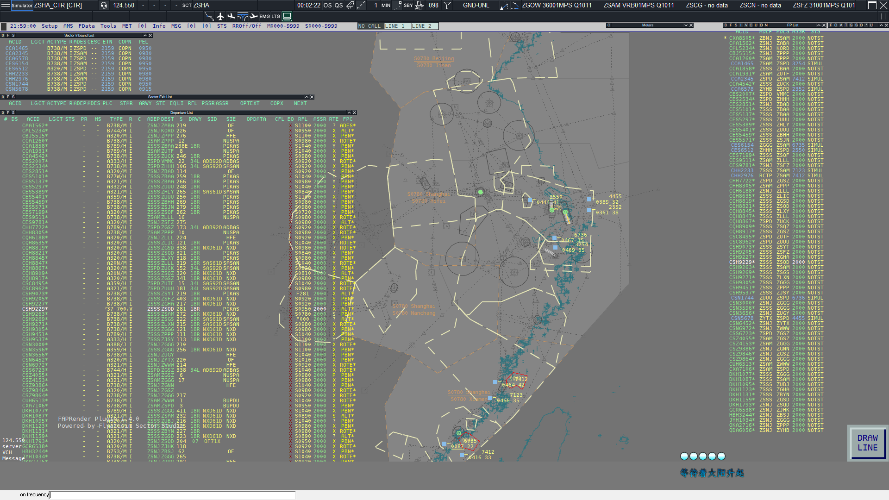

# SimpleFSD

[![ReleaseCard]][Release]![ReleaseDataCard]![LastCommitCard]  
![BuildStateCard]![ProjectLanguageCard]![ProjectLicense]



### *本项目正在快速迭代中, API接口可能不稳定, 请及时查阅最新的API文档*

## 简介

本项目是一个用Go语言编写, 主要用于模拟飞行的联机服务器  
支持 Swift, Euroscope 或其他自定义的客户端  
Echo未经过测试, 理论上任何实现了 FSD Version 3.000 Draft 9 协议的客户端均可链接   

## 特点  

- 支持计划同步：自动同步管制员对飞行计划的修改
- 支持计划锁定：自动锁定被管制员修改过的飞行计划，直到用户下线或者提交起落机场不同的计划
- 支持更加详细的管制员信息获取：例如可以获取到 Logoff time和管制员是否处于Break状态
- 支持 FSD Version 3.000 Draft 9 协议
- 支持 VATSIM(TOKEN) 协议与非满血 VATSIM2022 协议
- 支持高并发：golang原生支持
- 支持VisualPosition：可以做到0.2s上传一次位置
- 支持语音调频：本功能需要额外的软件
- 全功能HTTP服务器：不仅仅是FSD，还是飞控后端
- 支持Websocket连接：可以通过Websocket连接到FSD进行双向文字交互

如果您觉得这个FSD功能太多, 过于庞大  
我们还有专门精简过功能的[lite版本][Lite], 仅保留了核心的fsd功能  
当然我们还是建议您使用全功能版本以获得更好的体验  

想提交PR？想自己对服务器进行二次开发？请查阅我们的[文档][WIKI]

## 如何使用

### 使用方法

1. 获取服务器可执行文件  
   i. 在[Release]里面下载对应版本的构建  
   ii. 克隆整个存储库自己[构建](#构建方法)  
   iii. 也可以前往[Action]页面获取最新开发版(开发版本可能不稳定且会产生Bug, 请谨慎使用)
2. 运行服务器可执行文件, 第一次运行会报错并自动退出, 这是为了生成配置文件模板放置到同目录, 此时您可以  
   i. 先按照[配置文件简介](#配置文件简介)里面的介绍完成服务器配置后再启动  
   ii. 直接运行服务端可执行文件, 服务器会使用默认配置运行

***注意：默认配置下使用sqlite数据库存储数据, 而sqlite在多线程写入的时候有很严重的性能瓶颈, 且sqlite以单文件形式存储与磁盘,
受硬盘性能影响较大***

> 感谢3370的简易测试结果：  
> 在本地部署不考虑带宽的情况下, sqlite最多可以支持的客户端数量大约在200-300并且有概率断线  
> 而在使用mysql数据库的时候, 可以轻松跑到400+的客户端, 还有余力 ~~(因为测试程序是用python写的, 所以测试程序产生了瓶颈)~~

所以我们建议

1. 不要使用sqlite作为长期数据库使用
2. 不要在使用sqlite作为数据库的时候进行大流量或者大压力测试

如果真的没有部署大型关系型数据库(比如mysql)的条件  
那么我们建议将simulator_server开关打开, 即将本服务器作为模拟机服务器使用  
因为模拟机服务器模式下, 飞行机组的飞行计划不会写入数据库, 很大一部分是缓存在内存中,
可以一定程度上解决sqlite写入性能差的问题  
此项目不是纯粹的FSD项目, 同时也集成了HTTP API服务器与gRPC服务器  
在[此处](#链接)查看更详细的说明和查看API文档

### 构建方法

1. 克隆本仓库
2. 确保安装了go编译器并且版本>=1.23.4
3. 在项目根目录运行如下命令`go build -x .\cmd\fsd\`
4. \[可选\]使用upx压缩可执行文件  
   i.  (windows)`upx.exe -9 .\fsd.exe`  
   ii. (linux)`upx -9 .\fsd`
5. 等待编译完成后  
   i. 对于Windows用户, 可执行文件为fsd.exe   
   ii. 对于linux用户, 可执行文件为fsd

### 配置文件简介

```json5
{
  // 配置文件版本, 通常情况下与软件版本一致
  "config_version": "0.8.1",
  // 服务配置
  "server": {
    // 通用配置项
    "general": {
      // 是否为模拟机服务器
      // 由于需要实现检查网页提交计划于实际连线计划是否一致
      // 所以飞行计划存储是用用户cid进行标识的
      // 但模拟机所有的模拟机都是一个用户cid, 此时就会出问题
      // 即模拟机计划错误或者无法获取到计划
      // 这个时候将这个变量设置为true
      // 这样服务器就会使用呼号作为标识
      // 但是与此同时就失去了呼号匹配检查的功能
      // 但网页提交计划仍然可用, 只是没有检查功能
      // 所以将这个开关命名为模拟机服务器开关
      "simulator_server": false,
      // 密码加密轮数
      "bcrypt_cost": 12
    },
    // FSD服务器配置
    "fsd_server": {
      // FSD名称, 会被发送到连接到服务器的客户端作为motd消息
      "fsd_name": "Simple-Fsd",
      // FSD服务器监听地址
      "host": "0.0.0.0",
      // FSD服务器监听端口
      "port": 6809,
      // 机场数据路径, 若不存在会自动从github下载
      "airport_data_file": "data/airport.json",
      // 服务器飞行路径记录间隔
      // 这里间隔的意思是：当客户端每发过来N个包就记录一次位置
      "pos_update_points": 1,
      // FSD服务器心跳间隔, 超过此时间FSD会认为客户端断开连接
      // 由于ES的发包最大间隔为25s, 加之服务器处理也需要时间
      // 推荐此数值大于30s, 但不得小于25s
      "heartbeat_interval": "40s",
      // whazzup更新时间
      "whazzup_cache_time": "15s",
      // FSD服务器会话过期时间
      // 在过期时间内重连, 服务器会自动匹配断开时的session
      // 反之则会创建新session
      "session_clean_time": "40s",
      // 最大工作线程数, 也可以理解为最大同时连接的sockets数目
      "max_workers": 128,
      // 最大广播线程数, 用于广播消息的最大线程数
      "max_broadcast_workers": 128,
      // 首行发送到客户端的motd格式, 第一个参数为fsd_name, 第二个为版本号
      "first_motd_line": "Welcome to use %[1]s v%[2]s",
      // ES视程范围限制
      "range_limit": {
        // 是否断开超出视程范围的客户端
        "refuse_out_range": false,
        "observer": 300,
        "delivery": 20,
        "ground": 20,
        "tower": 50,
        "approach": 150,
        "center": 600,
        "apron": 20,
        "supervisor": 300,
        "administrator": 300,
        "fss": 1500
      },
      // 要发送到客户端的motd消息
      "motd": [
        "This is my test fsd server"
      ]
    },
    // Http服务器配置
    "http_server": {
      // 是否启用Http服务器
      "enabled": false,
      // 服务器的外网访问地址, 用于little nav map的在线航班显示
      // 如果你不需要little nav map的在线航班显示, 你可以不管这个
      "server_address": "http://127.0.0.1:6810",
      // Http服务器监听地址
      "host": "0.0.0.0",
      // Http服务器监听端口
      "port": 6810,
      // 代理类型
      // 0 直连无代理服务器
      // 1 代理服务器使用 X-Forwarded-For Http头部
      // 2 代理服务器使用 X-Real-Ip Http头部
      "proxy_type": 0,
      // 信任的ip来源, 用于获取真实用户ip
      // 详情请见: https://echo.labstack.com/docs/ip-address
      // 具体来说这里填写的是前方代理服务器的ip地址
      // 内网地址默认被信任
      // 如果网站前方有CDN, 那么这里需要填写CDN节点的所有可能节点IP
      // 格式为CIDR, 例如: 101.71.100.0/24
      "trusted_ip_range": [],
      // POST请求的请求体大小限制
      // 将本选项设置为空字符串可以禁用大小限制
      "body_limit": "10MB",
      // 服务器存储配置
      "store": {
        // 存储类型, 可选类型为
        // 0 本地存储
        // 1 阿里云OSS存储
        // 2 腾讯云COS存储
        "store_type": 0,
        // 储存桶地域, 本地存储此字段无效
        "region": "",
        // 存储桶名称, 本地存储此字段无效
        "bucket": "",
        // 访问Id, 本地存储此字段无效
        "access_id": "",
        // 访问秘钥, 本地存储此字段无效
        "access_key": "",
        // CDN访问加速域名, 本地存储此字段无效
        "cdn_domain": "",
        // 使用内网地址上传文件, 仅阿里云OSS存储此字段有效
        "use_internal_url": false,
        // 本地文件保存路径
        "local_store_path": "uploads",
        // 远程文件保存路径, 本地存储此字段无效
        "remote_store_path": "fsd",
        // 文件限制
        "file_limit": {
          // 图片文件限制
          "image_limit": {
            // 允许的最大文件大小, 单位是B
            "max_file_size": 5242880,
            // 允许的文件后缀名
            "allowed_file_ext": [
              ".jpg",
              ".png",
              ".bmp",
              ".jpeg"
            ],
            // 存储路径前缀
            "store_prefix": "images",
            // 是否在本地也保存一份
            // 使用本地存储时此字段必须为true
            "store_in_server": true
          },
          // 文件限制
          "file_limit": {
            "max_file_size": 10485760,
            "allowed_file_ext": [
              ".md",
              ".txt",
              ".pdf",
              ".doc",
              ".docx"
            ],
            "store_prefix": "files",
            "store_in_server": false
          }
        }
      },
      "limits": {
        // Api访问限速
        // 每个IP的每个接口均单独计算
        "rate_limit": 15,
        // Api访问限速窗口
        // 即 rate_limit 每 rate_limit_window
        // 滑动窗口计算
        "rate_limit_window": "1m"
      },
      // 邮箱配置
      "email": {
        // SMTP服务器地址
        "host": "smtp.example.com",
        // SMTP服务器端口
        "port": 465,
        // 发信账号
        "username": "noreply@example.cn",
        // 发信账号密码或者访问Token
        "password": "123456",
        // 邮箱验证码过期时间
        "verify_expired_time": "5m",
        // 验证码重复发送间隔
        "send_interval": "1m",
        // 邮件模板定义
        "template": {
          // 验证码模板
          "verify_code_email": {
            // 文件存储路径
            "file_path": "template/email_verify.template",
            // 邮件标题
            "email_title": "邮箱验证码",
            // 是否启用该邮件, 注意验证码邮件无法关闭
            "enable": true
          },
          "atc_rating_change_email": {
            "file_path": "template/atc_rating_change.template",
            "email_title": "管制权限变更通知",
            "enable": true
          },
          "permission_change_email": {
            "file_path": "template/permission_change.template",
            "email_title": "管理权限变更通知",
            "enable": true
          },
          "kicked_from_server_email": {
            "file_path": "template/kicked_from_server.template",
            "email_title": "踢出服务器通知",
            "enable": true
          },
          "password_change_email": {
            "file_path": "template/password_change.template",
            "email_title": "飞控密码更改通知",
            "enable": true
          },
          "application_passed_email": {
            "file_path": "template/application_passed.template",
            "email_title": "管制员申请通过",
            "enable": true
          },
          "application_rejected_email": {
            "file_path": "template/application_rejected.template",
            "email_title": "管制员申请被拒",
            "enable": true
          },
          "application_processing_email": {
            "file_path": "template/application_processing.template",
            "email_title": "管制员申请进度通知",
            "enable": true
          },
          "ticket_reply_email": {
            "file_path": "template/ticket_reply.template",
            "email_title": "工单回复通知",
            "enable": true
          }
        }
      },
      // JWT配置
      "jwt": {
        // JWT对称加密秘钥
        // 请一定要保护好这个秘钥
        // 并确保不被任何不信任的人知道
        // 如果该秘钥泄露, 任何人都可以伪造管理员用户
        // 更安全的做法是将本字段置空, 这样每次服务器重启都会使得之前的秘钥全部失效
        "secret": "123456",
        // JWT主密钥过期时间
        // 建议不要大于1小时, 因为JWT秘钥是无状态的
        // 所以如果主密钥过期时间太长可能会导致安全问题
        "expires_time": "15m",
        // JWT刷新秘钥过期时间
        // 该时间是在JWT主秘钥过期时间之后的时间
        // 比如两者都是1h, 那么刷新秘钥的过期时间就是2h
        // 因为不可能你刷新秘钥比主密钥过期还早:(
        "refresh_time": "24h"
      },
      // SSL配置
      "ssl": {
        // 是否启用SSL
        "enable": false,
        // 是否启用HSTS
        "enable_hsts": false,
        // HSTS过期时间(s)
        "hsts_expired_time": 5184000,
        // HSTS是否包括子域名
        // 警告：如果你的其他子域名没有全部部署SSL证书
        // 打开此开关可能导致没有SSL证书的域名无法访问
        // 如果不懂请不要打开此开关
        "include_domain": false,
        // SSL证书文件路径
        "cert_file": "",
        // SSL私钥文件路径
        "key_file": ""
      }
    },
    // gRPC服务器
    "grpc_server": {
      // 是否启用gRPC服务器
      "enabled": false,
      // gRPC服务器监听地址
      "host": "0.0.0.0",
      // gRPC服务器监听端口
      "port": 6811,
      // gRPC服务器Api缓存时间
      "whazzup_cache_time": "15s"
    }
  },
  // metar报文源
  "metar_source": [
    {
      // 查询地址, %s会被替换为机场ICAO码
      "url": "https://aviationweather.gov/api/data/metar?ids=%s",
      // 返回raw: 直接返回metar文本
      "return_type": "raw",
      // 数据排列方式, 此值为false时, 服务器取第一行作为metar报文, 反之取最后一行
      "reverse": false,
      // 数据分行方式
      // 当此行为空时, 服务器认为返回值里面仅有一条metar报文
      // 不为空时, 服务器按照此配置作为分隔符切分数据并按照`reverse`字段配置返回报文
      "multiline": ""
    },
    {
      "url": "https://example.com/api/metar?icao=%s&style=html",
      // 返回html: 返回一个html网页
      "return_type": "html",
      "reverse": false,
      // html css 选择器, 用于提取metar报文
      "selector": "body > div > pre",
      "multiline": "\n"
    },
    {
      "url": "https://example.com/api/metar?icao=%s&style=json",
      // 返回json: 返回json格式的数据
      "return_type": "json",
      // jsonpath字符串, 用于提取json中的metar报文
      "selector": "$.data.metar",
      "reverse": false,
      "multiline": "\n"
    }
  ],
  // 数据库配置
  "database": {
    // 数据库类型, 支持的数据库类型: mysql, postgres, sqlite3
    "type": "mysql",
    // 当数据库类型为sqlite3的时候, 这里是数据库存放路径和文件名
    // 反之则为要使用的数据库名称
    "database": "go-fsd",
    // 数据库地址
    "host": "localhost",
    // 数据库端口
    "port": 3306,
    // 数据库用户名
    "username": "root",
    // 数据库密码
    "password": "123456",
    // 是否启用SSL
    "enable_ssl": false,
    // 数据库连接池连接超时时间
    "connect_idle_timeout": "1h",
    // 连接超时时间
    "connect_timeout": "5s",
    // 数据库最大连接数
    // 这个数字请求改为你实际的数据库配置
    "server_max_connections": 32
  },
  // 特殊权限配置, 详情请见`特殊权限配置` 章节
  "rating": {},
  // 席位配置, 详情请见`特殊席位配置` 章节
  "facility": {}
}
```

### 命令行参数

| 参数名                         | 类型     | 默认值             | 作用                          |
|:----------------------------|:-------|:----------------|:----------------------------|
| -help                       | ×      | ×               | 显示命令帮助                      |
| -debug                      | bool   | false           | 开启调试模式                      |
| -config                     | string | "./config.json" | 配置文件路径                      |
| -skip_email_verification    | bool   | false           | 跳过邮箱验证                      |
| -update_config              | bool   | false           | 迁移配置文件, 迁移旧版本配置文件           |
| -no_logs                    | bool   | false           | 禁用日志输出到文件                   |
| -message_queue_channel_size | int    | 128             | 内置消息队列大小                    |
| -download_prefix            | str    | 本仓库raw地址        | 下载前缀, 用于无法连接到github或其他情况下使用 |
| -metar_cache_clean_interval | str    | 30s             | 过期metar报文清理间隔               |
| -metar_query_thread         | int    | 32              | metar报文查询线程数                |
| -fsd_record_filter          | int    | 10              | fsd连线记录数值过滤                 |

### 环境变量

***环境变量会覆盖对应的命令行参数***

| 参数名                        | 类型     | 默认值             | 作用                          |
|:---------------------------|:-------|:----------------|:----------------------------|
| DEBUG_MODE                 | bool   | false           | 开启调试模式                      |
| CONFIG_FILE_PATH           | string | "./config.json" | 配置文件路径                      |
| SKIP_EMAIL_VERIFICATION    | bool   | false           | 跳过邮箱验证                      |
| UPDATE_CONFIG              | bool   | false           | 迁移配置文件, 迁移旧版本配置文件           |
| NO_LOGS                    | bool   | false           | 禁用日志输出到文件                   |
| MESSAGE_QUEUE_CHANNEL_SIZE | int    | 128             | 内置消息队列大小                    |
| DOWNLOAD_PREFIX            | str    | 本仓库raw地址        | 下载前缀, 用于无法连接到github或其他情况下使用 |
| MESSAGE_QUEUE_CHANNEL_SIZE | int    | 128             | 内置消息队列大小                    |
| METAR_CACHE_CLEAN_INTERVAL | str    | 30s             | 过期metar报文清理间隔               |
| METAR_QUERY_THREAD         | int    | 32              | metar报文查询线程数                |
| FSD_RECORD_FILTER          | int    | 10              | fsd连线记录数值过滤                 |

### 权限定义表

#### FSD管制权限一览

| 权限识别名         | 权限值 | 中文名   | 说明                      |
|:--------------|:---:|:------|:------------------------|
| Ban           | -1  | 封禁    |                         |
| Normal        |  0  | 普通用户  | 默认权限                    |
| Observer      |  1  | 观察者   |                         |
| STU1          |  2  | 放行/地面 |                         |
| STU2          |  3  | 塔台    |                         |
| STU3          |  4  | 终端    |                         |
| CTR1          |  5  | 区域    |                         |
| CTR2          |  6  | 区域    | 该权限已被弃用, 这里写出来只是为了与ES同步 |
| CTR3          |  7  | 区域    |                         |
| Instructor1   |  8  | 教员    |                         |
| Instructor2   |  9  | 教员    |                         |
| Instructor3   | 10  | 教员    |                         |
| Supervisor    | 11  | 监察者   |                         |
| Administrator | 12  | 管理员   |                         |

#### 管制席位一览

注：Pilot往后的席位为虚拟席位, 实际EuroScope中并没有这些席位的选项

| 席位识别名 | 席位编码 | 中文名 | 说明         |
|:------|:-----|:----|:-----------|
| OBS   | 1    | 观察者 |            |
| FSS   | 2    | 飞服  |            |
| DEL   | 4    | 放行  |            |
| GND   | 8    | 地面  |            |
| TWR   | 16   | 塔台  |            |
| APP   | 32   | 进近  |            |
| CTR   | 64   | 区域  |            |
| Pilot | 128  | 飞行员 | 连线飞行员属于该席位 |
| RMP   | 256  | 机坪  |            |
| SUP   | 512  | 监察者 |            |
| ADM   | 1024 | 管理员 |            |

#### 管制权限与管制席位对照一览

| 权限识别名         | 允许的席位                                         | 说明   |
|:--------------|:----------------------------------------------|:-----|
| Ban           | 不允许任何席位                                       | 封禁用户 |
| Normal        | Pilot                                         |      |
| Observer      | Pilot,OBS                                     |      |
| STU1          | Pilot,OBS,DEL,GND,RMP                         |      |
| STU2          | Pilot,OBS,DEL,GND,RMP,TWR                     |      |
| STU3          | Pilot,OBS,DEL,GND,RMP,TWR,APP                 |      |
| CTR1          | Pilot,OBS,DEL,GND,RMP,TWR,APP,CTR             |      |
| CTR2          | Pilot,OBS,DEL,GND,RMP,TWR,APP,CTR             |      |
| CTR3          | Pilot,OBS,DEL,GND,RMP,TWR,APP,CTR,FSS         |      |
| Instructor1   | Pilot,OBS,DEL,GND,RMP,TWR,APP,CTR,FSS         |      |
| Instructor2   | Pilot,OBS,DEL,GND,RMP,TWR,APP,CTR,FSS         |      |
| Instructor3   | Pilot,OBS,DEL,GND,RMP,TWR,APP,CTR,FSS         |      |
| Supervisor    | Pilot,OBS,DEL,GND,RMP,TWR,APP,CTR,FSS,SUP     |      |
| Administrator | Pilot,OBS,DEL,GND,RMP,TWR,APP,CTR,FSS,SUP,ADM |      |

### 特殊权限配置

你可以通过配置文件覆写管制权限与管制席位对照表  
注意!!! 这个字段会`覆盖`默认的对照表  
所以在明确的知道你在做什么之前, 不要修改这个配置  
配置文件字段为`rating`

```json5
{
  // 特殊权限配置
  "rating": {
    // 键为想要修改的权限识别名的权限值
    // 比如我想让Normal也可以上OBS席位, 也就是普通飞行员也可以以OBS身份连线
    // Normal的权限值是0, 那我的键就是0
    // 值为想要许可连线的席位的席位编码之和
    // 比如我想让飞行员可以正常连线, 也可以以OBS连线
    // 那么值就是 128 + 1 = 129
    // 如果我想他还能上个飞服(请勿模仿)
    // 那么值就是 128 + 1 + 2 = 131
    // 其他权限的对照表保持为默认
    // 你也可以将某个权限的值写为0来禁止使用该权限登录fsd
    "0": 3
  }
}
```

### 特殊席位配置

你可以通过配置文件覆写呼号后缀与管制席位对照表  
注意!!! 这个字段会`覆盖`默认的对照表  
默认的席位对照表如下

| 席位后缀名 | 允许的席位 |
|:------|:------|
| ADM   | ADM   |  
| SUP   | SUP   |    
| OBS   | OBS   |    
| DEL   | DEL   |    
| RMP   | RMP   |    
| GND   | GND   |    
| TWR   | TWR   |    
| APP   | APP   |    
| CTR   | CTR   |    
| FSS   | FSS   |    
| ATIS  | TWR   |    

在明确的知道你在做什么之前, 不要修改这个配置  
配置文件字段为`facility`

```json5
{
  // 特殊席位配置
  "facility": {
    // 键为想要修改呼号后缀名
    // 什么是呼号后缀名？
    // 比如有个管制的呼号为XXXX_YYY, 后缀名就是YYY
    // 如果呼号是XXX_Y_ZZZ, 后缀名就是ZZZ, 以此类推
    // 值为登录该席位需要的许可席位的席位编码之和
    // 如果没有需要的权限，服务器会拒绝连接
    // 当然如果当前权限值就不允许登录该席位, 那么自然是无效的
    // 比如你用GND的权限登录TWR席位, 那自然是不允许登录的
    // 同时这个配置允许你自定义席位后缀名
    // 比如我设置一个席位后缀为BOT, 然后它可以用OBS席位登录
    // 配置项如下
    // "BOT": 1
    // 那么我就可以用ZZZZ_BOT登录服务器了
    // 你也可以对某个席位设置一个足够大的数字, 从而禁用该席位登录fsd
    "TWR": 16
  }
}
```

---

> 在EuroScope中, Callsign, Facility, Rating 是三个独立的值
> 但在本FSD中, 三者之间是有对应联系的


--- 

## 反馈办法

如您在使用FSD中遇到了任何/疑似bug的错误，请提交[Issue]
在提交时，需要您按照以下步骤进行：

1. 对于可复现的bug:
    1. 对可执行文件添加`-debug`命令行参数以启用详细日志输出
    2. 复现此bug
    3. 将log文件上传至[Issue]
2. 对于不可复现的bug:
    1. 尽可能的用文字描述此bug并提交至[Issue]

## 链接

[Http Api文档][HttpApiDocs]

## 开源协议

MIT License

Copyright © 2025 Half_nothing

无附加条款。

## 行为准则

在[CODE_OF_CONDUCT.md](./CODE_OF_CONDUCT.md)中查阅

[ReleaseCard]: https://img.shields.io/github/v/release/Flyleague-Collection/SimpleFSD?style=for-the-badge&logo=github

[ReleaseDataCard]: https://img.shields.io/github/release-date/Flyleague-Collection/SimpleFSD?display_date=published_at&style=for-the-badge&logo=github

[LastCommitCard]: https://img.shields.io/github/last-commit/Flyleague-Collection/SimpleFSD?display_timestamp=committer&style=for-the-badge&logo=github

[BuildStateCard]: https://img.shields.io/github/actions/workflow/status/Flyleague-Collection/SimpleFSD/go-build.yml?style=for-the-badge&logo=github&label=Full-Build

[Lite]: https://github.com/Flyleague-Collection/SimpleFSD-Lite

[ProjectLanguageCard]: https://img.shields.io/github/languages/top/Flyleague-Collection/SimpleFSD?style=for-the-badge&logo=github

[ProjectLicense]: https://img.shields.io/badge/License-MIT-blue?style=for-the-badge&logo=github

[Release]: https://www.github.com/Flyleague-Collection/SimpleFSD/releases/latest

[Action]: https://github.com/Flyleague-Collection/SimpleFSD/actions/workflows/go-build.yml

[Issue]: https://github.com/Flyleague-Collection/SimpleFSD/issues/new?template=bug_report.yaml

[HttpApiDocs]: https://api.fsd.half-nothing.cn/

[WIKI]: https://docs.fsd.half-nothing.cn/