# CDN配置

本文档用于指导用户对FSD进行正确的CDN配置  
本文档使用腾讯云进行CDN配置示例  
其他CDN提供商请读者灵活变通  

!> 这里CDN代理指的是代理FSD捆绑的Http服务器! 而不是FSD本体  
FSD本体不能过CDN! CDN设计上就不是为了TCP长连接设计的  
所以不要用CDN加速FSD本体!!!  
对于本项目, CDN主要作用是隐藏服务器真实IP地址与减少服务器访问延迟  

## 前期准备
1. 已经部署好FSD的服务器
2. 一个已经备案好的域名
3. 一个腾讯云账号, 记得先充点钱

## CDN配置
1. 首先登陆腾讯云账号, 进入[CDN管理控制台](https://console.cloud.tencent.com/cdn/domains)
2. 添加一个CDN加速域名
    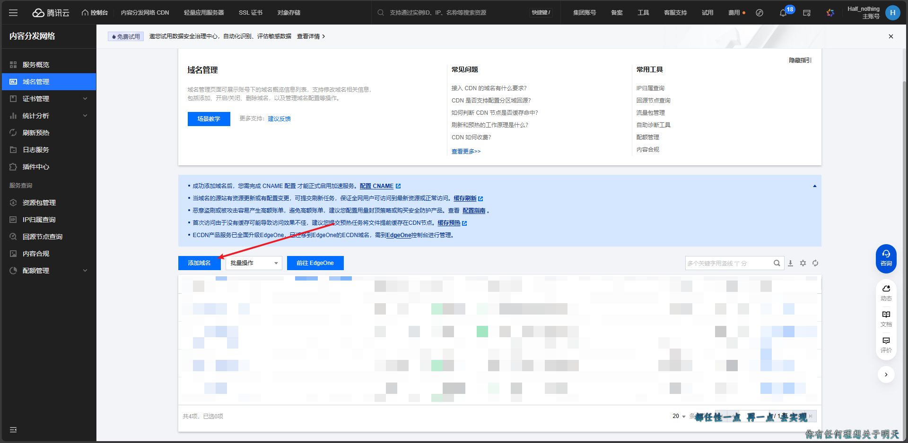
3. 配置CDN基础信息  
    `加速区域`按需选择, 如果不需要海外加速选择`中国境内`就行  
    `加速域名`填写需要加速的域名, 这里我们随便填一个`api.apocfly.com`  
    `加速类型`选择`CDN 网页小文件`  
    `IPV6访问`按需开启  
    `所属项目`与`标签`可以随意填写  
    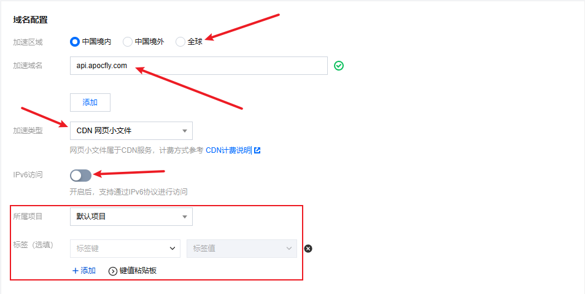
4. 配置CDN源站信息  
    `源站类型`选择`自有源`  
    `回源协议`按实际访问协议来选择, 不建议选择协议跟随, 建议手动指定访问协议  
    `源站地址`填写实际服务器的访问地址与端口  
    `回源Host`如果你的服务器使用了nginx之类的反向代理来区分不同的网站, 可以修改此处, 其余情况下不需要动  
    
5. 推荐配置  
    推荐配置直接跳过即可, 我们需要特殊配置  
    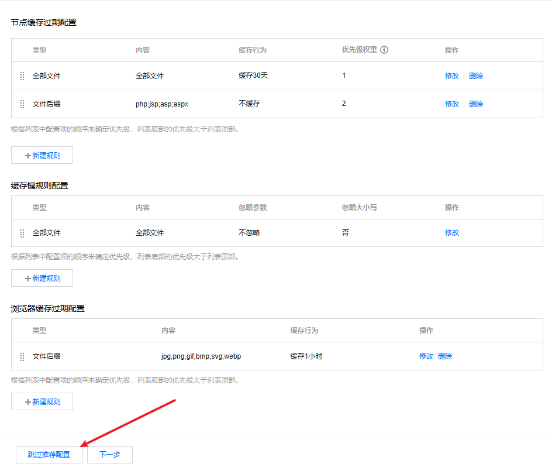
6. 配置CNAME  
    如果域名挂靠在腾讯云, 可以一键添加CNAME记录  
    否则需要手动为域名添加CNAME记录  
    检查CNAME记录生效后, 点击完成  
    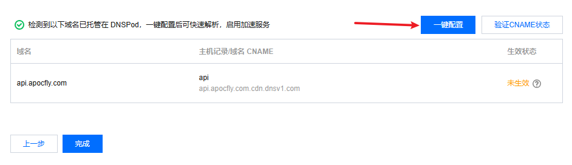
7. 进入CDN管理
    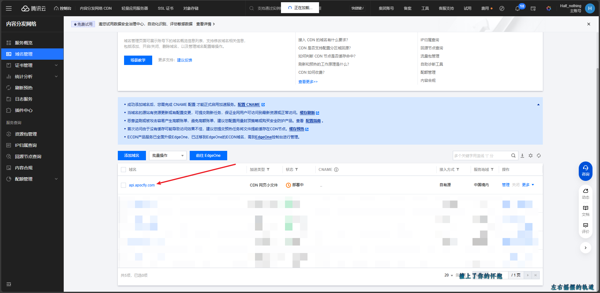
8. 进入缓存管理页面  
    删除除了第一行以外的所有内容  
    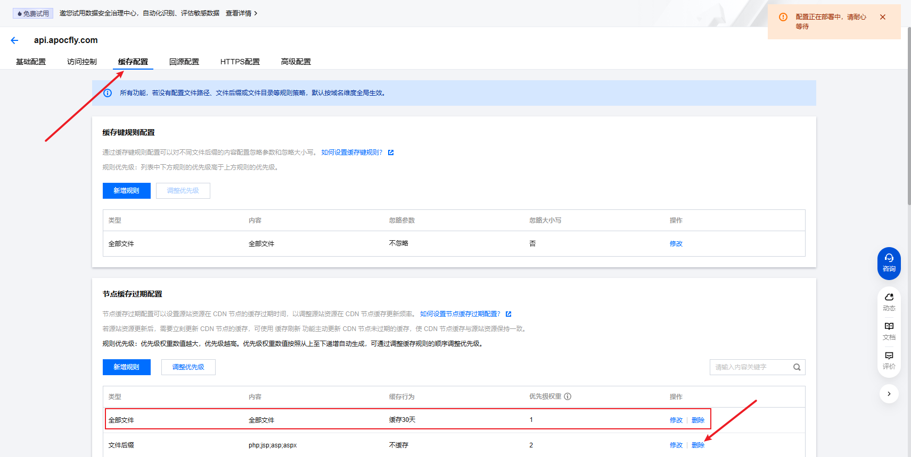
9. 新增缓存规则  
    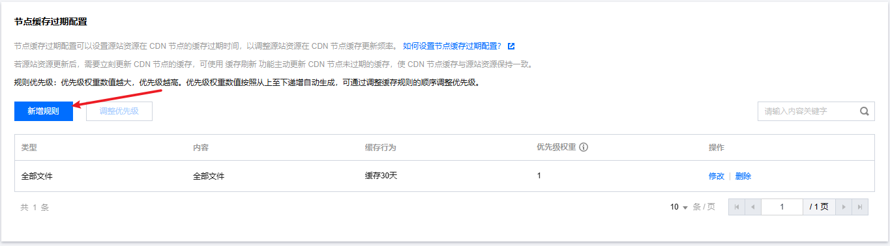
10. 如下图填写缓存规则  
    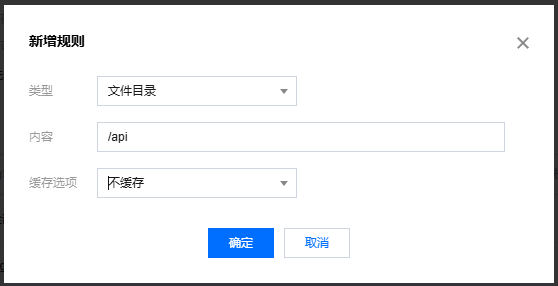  
    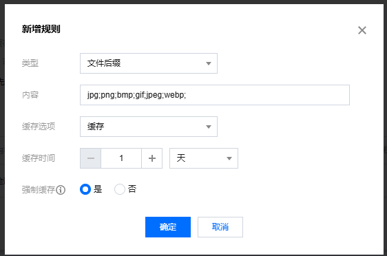
11. 最终的缓存规则应该如下图所示  
    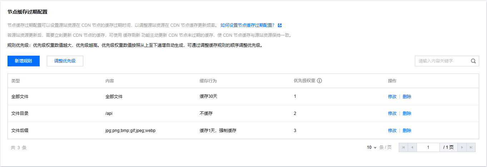
12. 推荐设置用量封顶  
    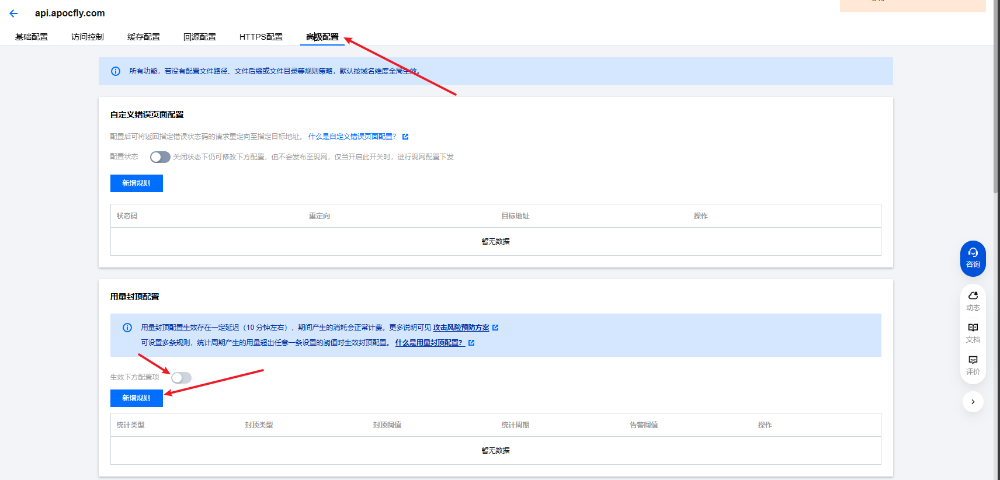  
    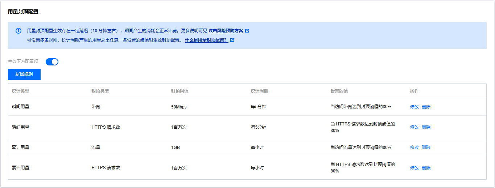

## FSD配置
由于腾讯云已经默认携带`X-Forwarded-For`HTTP头部  
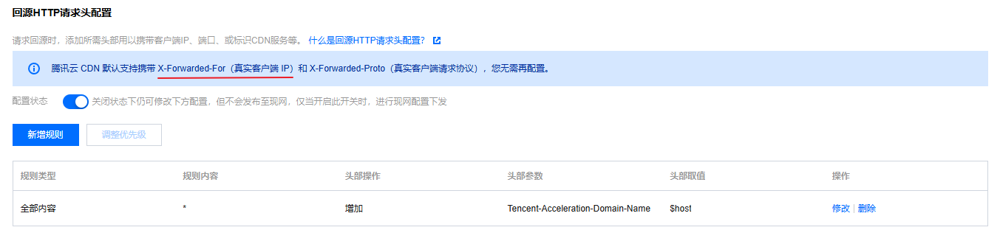
所以只需要对FSD的配置文件稍作修改即可  
如果你的CDN提供商不是腾讯云, 请自行修改

我们主要修改两个配置项  
1. [proxy_type](../configuration/config.md#proxy_type代理类型)
2. [trusted_ip_range](../configuration/config.md#trusted_ip_range信任的代理服务器地址)

对于腾讯云，`proxy_type`为`1`，即`代理服务器使用Http头部X-Forwarded-For`  
对于`trusted_ip_range`，请填写CDN的节点IP地址  
腾讯云可以直接查询 [回源节点查询](https://console.cloud.tencent.com/cdn/originpull)  
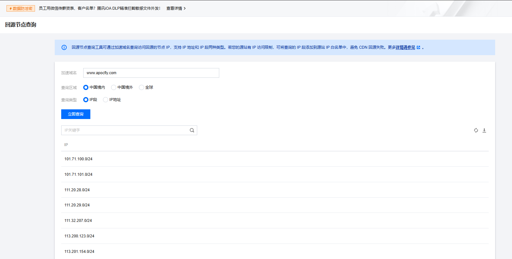  
将查询出来的IP段填写到`trusted_ip_range`中即可  