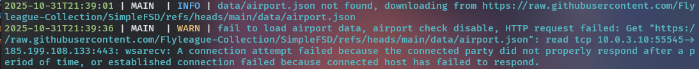
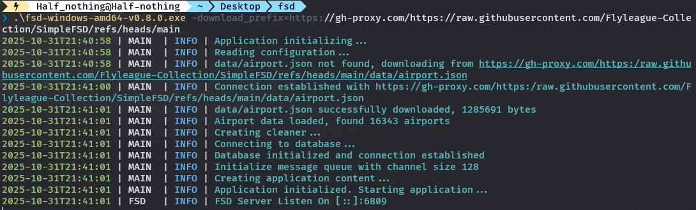

# 快速开始

## 获取服务器可执行文件

i. 在[Release]里面下载对应版本的构建  
ii. 克隆整个存储库自己[构建]()  
iii. 也可以前往[Action]页面获取最新开发版(开发版本可能不稳定且会产生Bug, 请谨慎使用)

## 运行服务器可执行文件

?> 第一次运行会报错并自动退出, 这是为了生成配置文件模板放置到同目录  

此时您可以  
i. 先按照[配置文件简介](./config.md)里面的介绍完成服务器配置后再启动  
ii. 直接运行服务端可执行文件, 服务器会使用默认配置运行

如果您在FSD的输出日志中发现如下内容  

那大概来说是因为您当前网络无法访问到github或者访问速度太慢  
此时您可以加上命令行参数`-download_prefix='https://gh-proxy.com/https://raw.githubusercontent.com/Flyleague-Collection/SimpleFSD/refs/heads/main'`  
详见[命令行参数#download_prefix](/configuration/command_line.md#download_prefix)  
此时不出意外的话就可以正常运行了  
资源文件仅需首次运行时下载一次  
  
当您看到`FSD Server Listen On ...`的时候, 代表服务器成功启动

[Release]: https://www.github.com/Flyleague-Collection/SimpleFSD/releases/latest

[Action]: https://github.com/Flyleague-Collection/SimpleFSD/actions/workflows/go-build.yml
